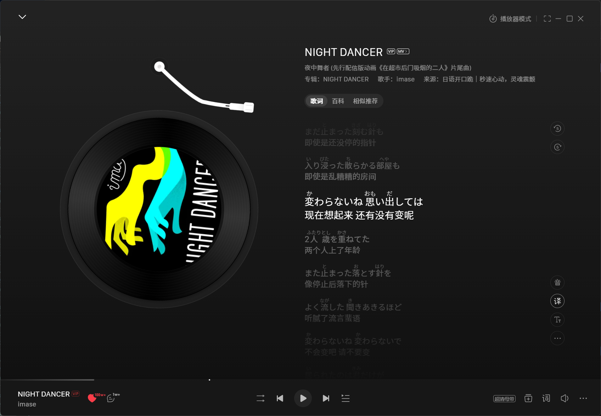

# 日语歌词振假名 · jp-furigana

在网易云音乐的日文歌词的汉字上方标注振假名

## 环境

- 网易云音乐 **2.10.x / 3.x** (在 2.10.13 和 3.1.36 上实测)
- [BetterNCM](https://github.com/std-microblock/BetterNCM) **1.3.4+**

## 安装

从 [Releases](../../releases) 下载 `jp-furigana.plugin`, 放进 BetterNCM 的插件目录后重启网易云

## 说明

- 默认在换歌时向网易云的歌词接口请求一次官方音译; 设置里把 "读音来源" 切成 "只用词典" 即完全离线, 由内置的 kuromoji + IPADIC 词典推读音
- 桌面歌词无效, 那是原生窗口而不是网页

## 许可

插件自身的代码采用 **MIT** 协议, 见 [LICENSE](LICENSE)

打包分发的第三方组件见 [NOTICE.md](NOTICE.md):

| 组件 | 许可 |
| --- | --- |
| `kuromoji.js` | Apache-2.0 ([LICENSE-kuromoji.txt](LICENSE-kuromoji.txt)), 已修改, 文件头带修改说明 |
| `dict/*.dat.gz` | mecab-ipadic-2.7.0-20070801, NAIST + ICOT |
